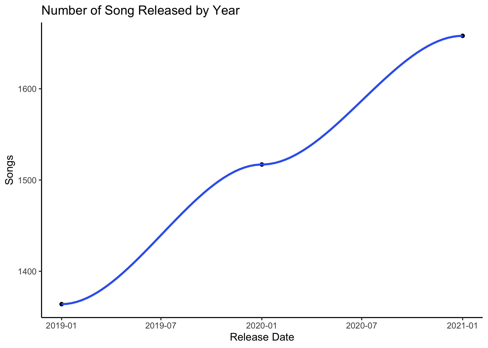
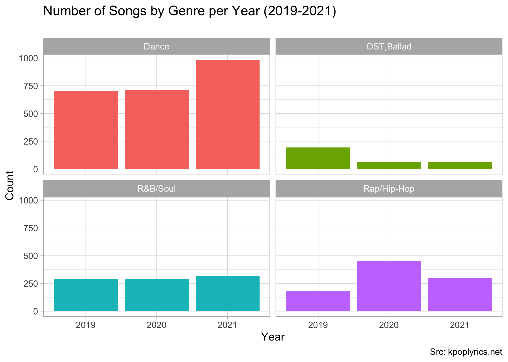
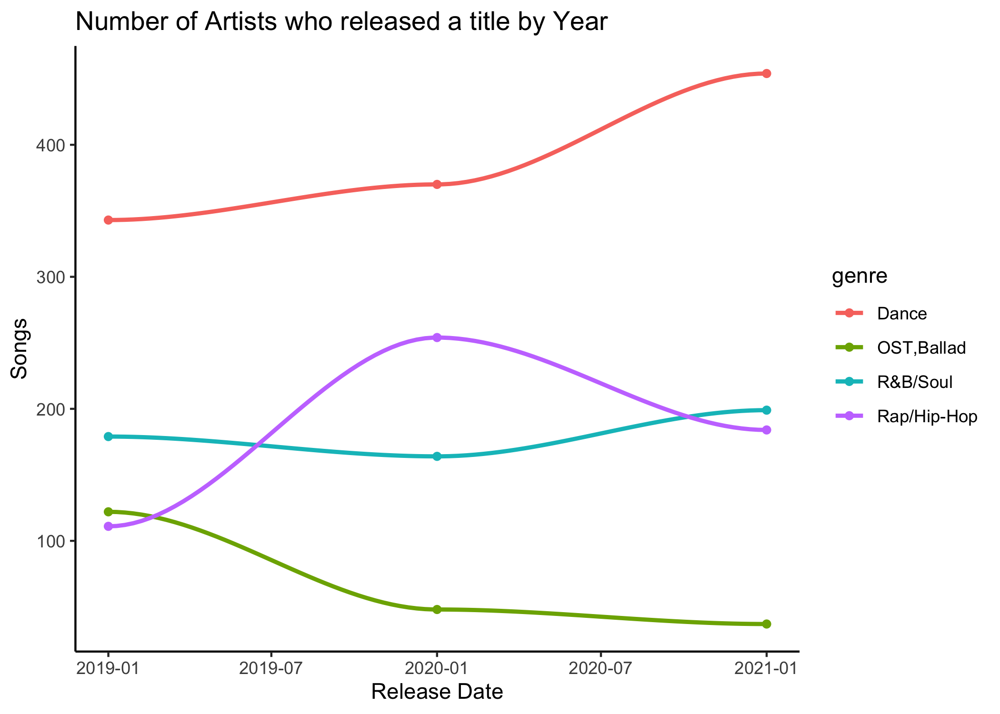
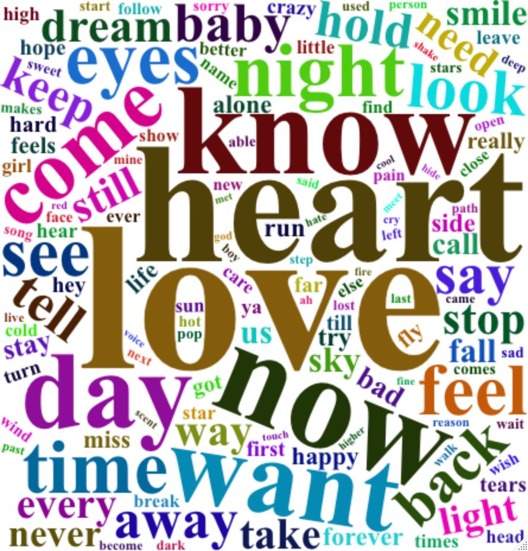
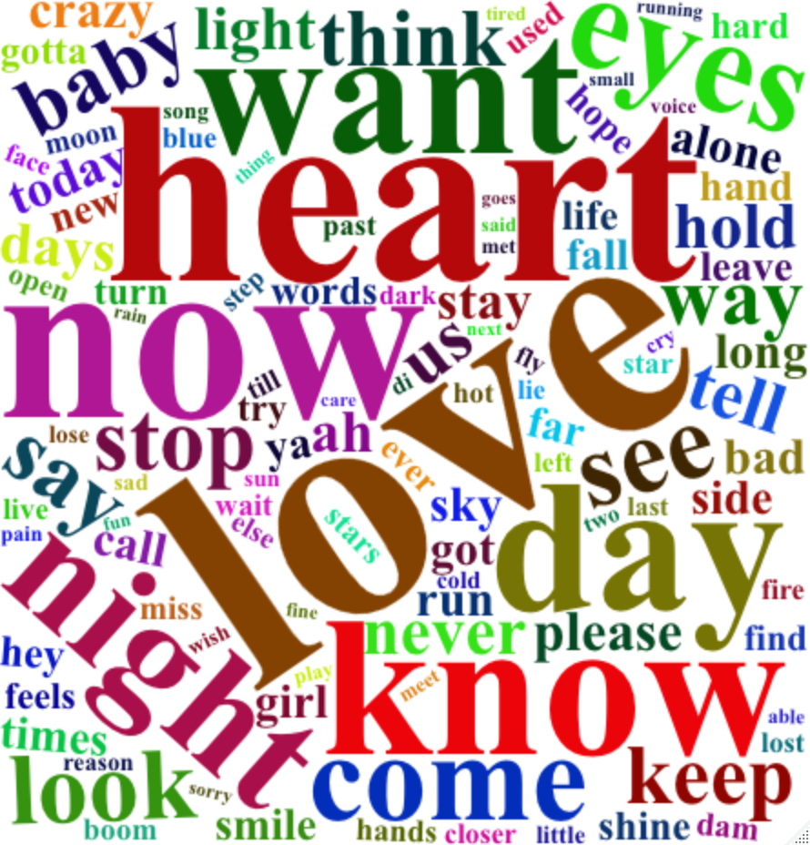
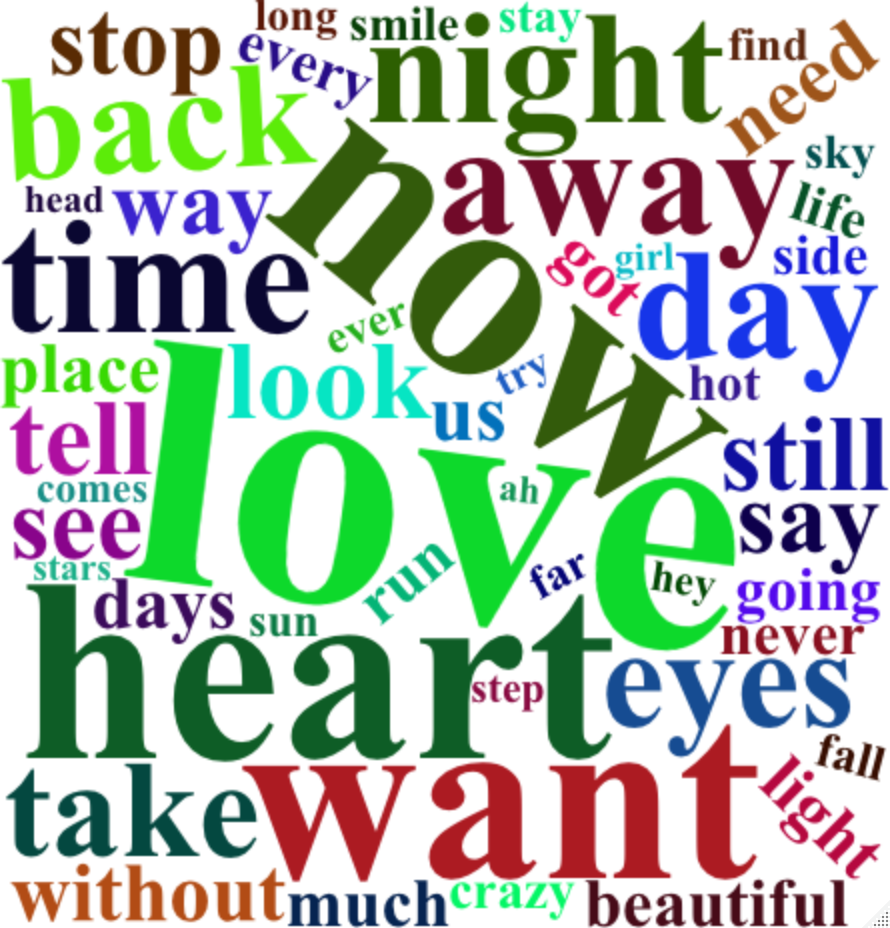
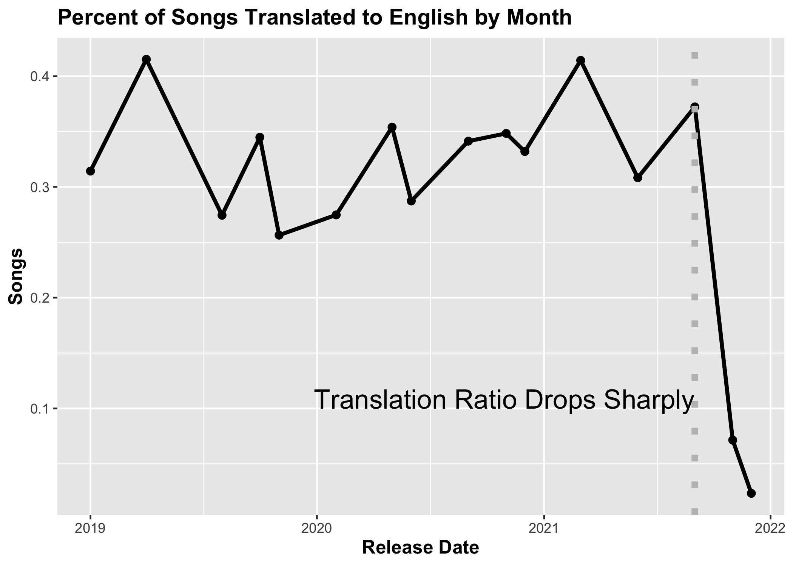

```{r setup, include=FALSE}
knitr::opts_chunk$set(echo = FALSE)
library(dplyr)
library(kableExtra)
```

## Introduction

<font size="5">There is no doubt that the COVID-19 pandemic has influenced many industries, including the music industry. This song analysis was conducted as an effort to learn about how the pandemic affected the Korean music industry. In particular, it aims to analyze possible changes in genres before and after the pandemic, possible increases or decreases in the production of music, and possible changes in the content of the lyrics. </font>

## Methodology

<font size="5">
- Downloaded lyrics from https://kpoplyrics.net<br> 
- Total of 13,545 songs. 4,841 songs with English translation<br> 
- Parsed text to extract words; stopwords were removed<br> 
- Definitions: Pre-COVID Period (Jan 2019 - Apr 2020), The height of COVID (Apr 2020 - Jan 2021), Post-COVID period (Jan 2021 - Dec 2021).</font>


## Songs per Year {.smaller}

<font size="1">- The core insight that this visualization communicates is that the number of songs being released seem to have increased during and after the height of COVID, compared to before COVID. Although it is difficult to pinpoint a leading cause for this trend, a possible speculation is that quarantine and isolation prevented people from doing many outside activities, inspiring them to participate more in unaffected activities such as writing and releasing songs. The line graph helps to show an upward trend in the release of songs.</font>

```{r, out.width='80%', fig.align='center'}

```


## Songs per Year by Genre {.smaller}

<font size="1">- The core insight that this visualization communicates is that the popularity of some genres have changed while others stayed rather stagnant. In particular, it seems like dance songs have increased a significant amount in times after the height of COVID. This may perhaps be to the lessening of social distancing requirements or the desire to feel free. OST/Ballad songs, on the other hand, decreased during and post-COVID. A possible cause for this is that COVID prevented the movie/drama industry from being as active as it was before, due to distancing requirements. The bar graphs separated by genres helps to paint the trend of genres throughout the years.</font>

```{r, out.width='80%', fig.align='center'}

```

## Songs per Year by Genre (Cont.) {.smaller}

<font size="1">- The line graphs separated by genres provides an alternative view of the change in genres over the years. Again, it appears that the dance genre became more popular, while the R&B/Soul genre stayed rather rather stagnant. Rap/Hip-Hop seemed to have increased before COVID but started to decrease again during. OST/Ballad appears to have decreased during and after COVID.</font>

```{r, out.width='80%', fig.align='center'}

```

## Word Cloud

<font size="3">- The following word clouds display the most commonly occurring words in songs, divided by time periods. This visualization helps to understand the difference in song topics throughout different periods, especially as the words are scaled according to their frequency of appearance.</font>

## Word Cloud - Pre-Covid {.smaller}

```{r, out.width='60%', fig.align='center'}

```

## Word Cloud - Covid {.smaller}


```{r, out.width='60%', fig.align='center'}

```


## Word Cloud - Post-Covid {.smaller}


```{r, out.width='60%', fig.align='center'}

```

## Word Table

<font size="5">- The following word table displays the top 24 commonly occuring words in lyrics by time period. There are some notable trends, such as that the word 'away' was significantly higher in Covid and Post-Covid sections, while 'time' was listed in Covid and Post-Covid but not in pre-Covid. These words align with the feelings of longing and grief, the desire for time to pass, and the uncertainty of time that came with Covid. Another significant observation is that there were many overlapping words with similar rankings across all time periods, such as 'love' and 'know' and 'eyes'. Thus, this table communicates that song lyrics may have been slightly influenced by the pandemic, but the general topics seemed to remain the same.</font>


## Word Table (1)

```{r}
readRDS('freq_table.rds') %>% filter(row_number() <= 8) %>% kable() %>% kable_styling()
```


## Word Table (2)


```{r}
readRDS('freq_table.rds') %>% filter(row_number() > 9 & row_number() <= 16) %>% kable() %>% kable_styling()
```

## Word Table (3)


```{r}
readRDS('freq_table.rds') %>% filter(row_number() > 16 & row_number() <= 24) %>% kable() %>% kable_styling()
```

## English translation of lyrics {.smaller}

<font size="1">- The core insight of this visualization suggests that COVID-19 even affected the lyrics translation sites. As seen in the graph, the ratio of songs being translated from Korean to English on this website dropped drastically during times of COVID.</font>

```{r, out.width='80%', fig.align='center'}

```


## Citation

https://kpoplyrics.net